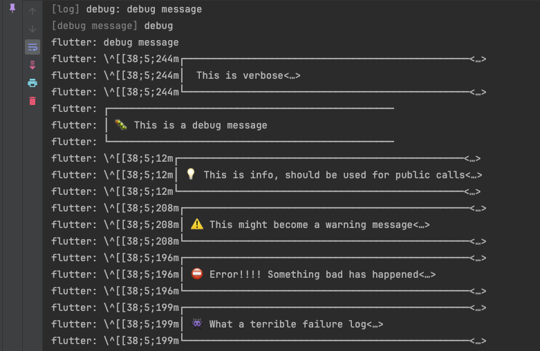

# Logger Flutter

This project is for learning how to debug using logger in Flutter.

``` dart
var logger = Logger(printer: PrettyPrinter(methodCount: 0, errorMethodCount: 2, lineLength: 50));
```

## Screenshot
 
